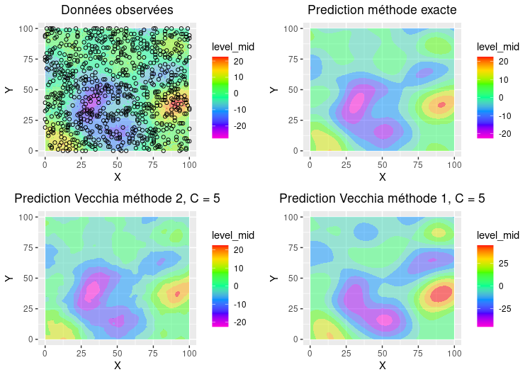

# Vecchia Approximation Demo  
R code, data, and graphics about the Vecchia approximation.

---

## **Description du Projet**  
Ce projet illustre l'utilisation de l'approximation de Vecchia pour des processus gaussiens, à travers du code R, des simulations et des visualisations. L'approximation de Vecchia permet une manipulation efficace des matrices de covariance dans les modèles spatiaux, notamment pour des ensembles de données de grande taille.

---

## **Structure du Code**  
Le code est divisé en deux fichiers principaux :  

1. **`Vecchia_functions.R`** : Contient les fonctions nécessaires à l'approximation de Vecchia et aux prédictions.  
2. **`Vecchia_simulation.R`** : Simule un processus gaussien et applique les méthodes de prédiction (exacte et approchée).

---

### **1. Détails des Fonctions dans `Vecchia_functions.R`**  
Ce fichier implémente plusieurs fonctions clés :  

#### **1.1 Fonctions de Décomposition Matricielle**  
- **`Get_lower`** et **`get_B_F`** :  
  Ces fonctions génèrent les matrices triangulaires nécessaires pour représenter la matrice de précision approximée, Q_tilde, sous la forme :
  
Q_tilde = B^T * F * B

  -  B  : Matrice triangulaire inférieure.  
  -  F  : Matrice diagonale.  

L'appel à `Get_lower`, qui utilise `get_B_F`, retourne ces deux matrices.

#### **1.2 Krigeage Exact**  
- **`exact_krig`** :  
  Cette fonction implémente le krigeage exact (sans approximation de Vecchia) et sert de référence pour évaluer la qualité des prédictions approximées.

#### **1.3 Krigeage avec l'Approximation de Vecchia**  
- **`krig_vecchia_method1`** :  
  Implémente la prédiction en utilisant l'approximation de Vecchia. La matrice de précision Q_tilde est utilisée pour approcher l'inverse de la matrice de covariance des observations, Sigma_obs/obs, dans la formule suivante :  

Pred_tilde = Sigma_pred/obs * Q_tilde * Y

- **`krig_vecchia_method2`** :  
  Utilise une approche différente en intégrant l'approximation directement dans la matrice de covariance pour les observations et les prédictions :  

Pred = -(Q_tilde_pred/pred)^-1 * Q_tilde_pred/obs * Y

Des détails supplémentaires sur ces fonctions, y compris l'implémentation de `Get_lower`, sont disponibles dans le fichier PowerPoint dans le dossier `/presentation`.

---

### **2. Simulation dans `Vecchia_simulation.R`**  
Ce fichier génère un processus gaussien sur une grille \( 90 \times 90 \) (8100 points) avec les paramètres suivants :  
- Moyenne :  0   
- Covariance : Fonction de Matérn ( \nu = 4.5 )  
  - Variance : 50  
  - Portée :  5   
  - Pepite :  2.5   

 Données Observées :  
   Le vecteur \( N \) représente les positions des données observées, correspondant à \( 10\% \) des points totaux.  

 Prédiction :  
   - Prédiction exacte avec **`exact_krig`**.  
   - Prédictions approximées avec les méthodes Vecchia :  
     - \( C = 5 \)  
     - \( C = 50 \)  
     - \( C = 100 \)
     -   
 Visualisations :  
   Les graphiques générés à partir des prédictions sont enregistrés dans le dossier `/Figures`.

References : 

 -Le papier original de Vecchia :
Vecchia, A. V. (1988). Estimation and model identification for continuous spatial processes. J. Roy. Statist. Soc. Ser. B 50 297–312.

-Etude de l’ordre et du regroupement des données :
Guinness J. Permutation and Grouping Methods for Sharpening Gaussian Process Approximations. Technometrics. 2018;

-Pour le calcul optimisé du maximum de vraisemblance avec l’algorithme de « fisher scoring »:
Guinness, J. (2021). Gaussian process learning via Fisher scoring of Vecchia’s approximation. Statistics and Computing,

-La construction de la matrice de précision, du calcul bayésien en utilisant Vecchia :
Datta, A., Banerjee, S., Finley, A. O., & Gelfand, A. E. (2016). Hierarchical nearest-neighbor Gaussian process models for large geostatistical datasets. Journal of the American Statistical Association

-Pour la prédiction en utilisant l’approximation de Vecchia :
Katzfuss & guiness 2020, Vecchia approximations of Gaussian-process predictions

-Généralisation de Vecchia :
Katzfuss, M., & Guinness, J. (2021). A general framework for Vecchia approximations of Gaussian processes.

-Package GpGp R :
https://cran.r-project.org/web/packages/GpGp/index.html

---
